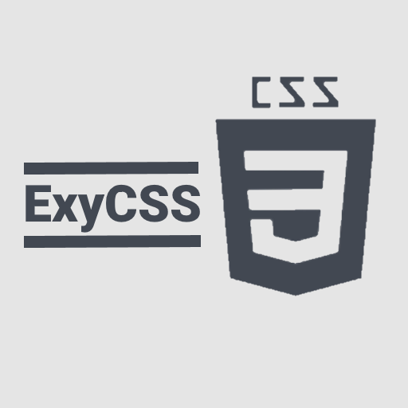

<div align="center">
	
	<p align="center">
		
		<a href="https://discord.gg/wfyYYjC"></a>
	</p>
</div>

ExyCSS is a front-end framework which simplifies website development, while remaining beautiful and functional. Flexible, it allows you to design your websites easily and quickly.

## ⤵ Setup guide

You can setup your project including ExyCSS with many options listed below.

### Option 1 : Clone the repository

Clone or download the repository and get files from the `dist` folder. Then, add them to your project with the folowing code :

```html
<head>
  <link rel="stylesheet" type="text/css" href="/path/to/exy.min.css" />
  <script type="text/javascript" href="/path/to/exy.min.js"></script>
</head>
```

### Option 2 : Use files on the framework's website

Include this snippet in your code :

```html
<head>
  <link
    rel="stylesheet"
    type="text/css"
    href="https://css.exybore.fr/dist/exy.min.css"
  />
  <script type="text/javascript" href="https://css.exybore.fr/dist/exy.min.js"
</head>
```

### Option 3 : Use npm

Download the framework using `npm i exycss`. Then, load it in your main Javascript file :

```javascript
import 'exycss/dist/exy.min.js'
import 'exycss/dist/exy.min.css' // Ensure you are using css-loader
```

### Import font and icons

The framework uses the Roboto font, and the Material Icons. Import them in your code :

```html
<link
  href="https://fonts.googleapis.com/css?family=Roboto:300,400,400i,500,700,900"
  rel="stylesheet"
/>
<link
  rel="stylesheet"
  href="https://fonts.googleapis.com/icon?family=Material+Icons"
/>
```

## 👍 You're ready !

Check the [documentation](https://github.com/exybore/exycss/blob/docs/summary.md) to explore the framework's possibilities !

## ⌨ Develop

The framework uses ECMAScript 2015 and Stylus in its core. The bundles are generated by Webpack.

To develop the framework, first install dependencies :

```bash
npm install # if you use NPM
yarn install # if you use Yarn
```

Then, run the `dev` script :

```bash
npm run dev
yarn run dev
```

Webpack will be watching for changes and generate the output in the `dist` directory.

To compile the framework, run the `build` script :

```bash
npm run build
yarn run build
```

Files will be minified and be outputed in the `dist` directory.
